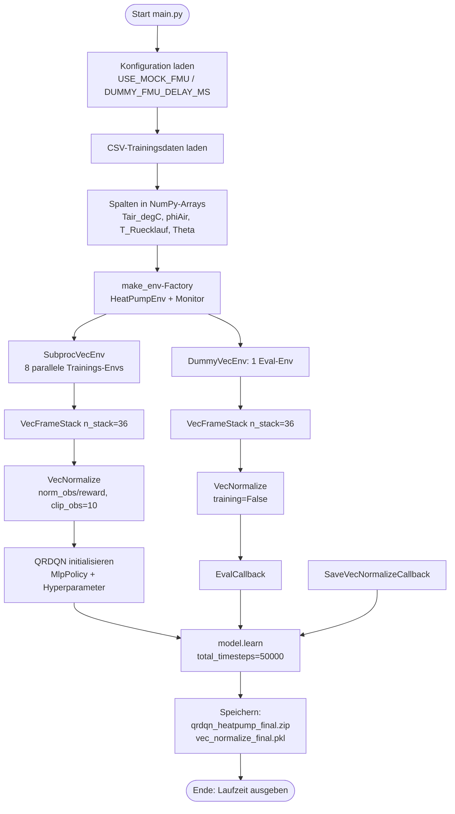
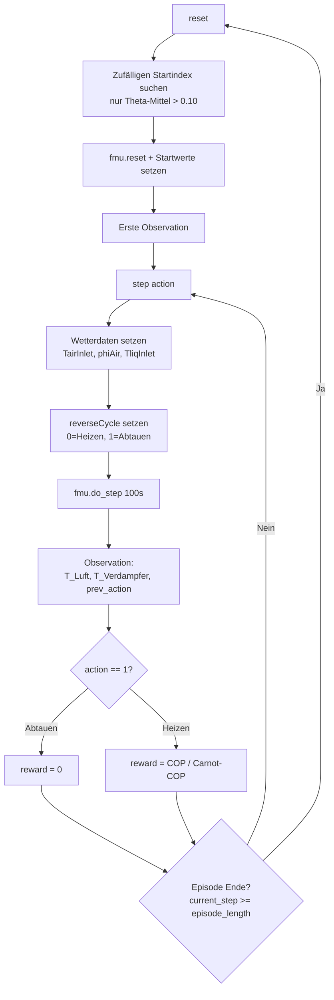

```mermaid
flowchart TD

    Start([Start main.py]) --> Config[Konfiguration laden<br/>USE_MOCK_FMU / DUMMY_FMU_DELAY_MS]

    Config --> LoadCSV[CSV-Trainingsdaten laden]

    LoadCSV --> ToNumpy[Spalten in NumPy-Arrays<br/>Tair_degC, phiAir, T_Ruecklauf, Theta]

    ToNumpy --> MakeEnv[make_env-Factory<br/>HeatPumpEnv + Monitor]

  

    MakeEnv --> SubVec[SubprocVecEnv<br/>8 parallele Trainings-Envs]

    SubVec --> FrameStack[VecFrameStack n_stack=36]

    FrameStack --> VecNorm[VecNormalize<br/>norm_obs/reward, clip_obs=10]

  

    MakeEnv --> EvalEnv[DummyVecEnv: 1 Eval-Env]

    EvalEnv --> EvalStack[VecFrameStack n_stack=36]

    EvalStack --> EvalNorm[VecNormalize<br/>training=False]

  

    VecNorm --> ModelInit[QRDQN initialisieren<br/>MlpPolicy + Hyperparameter]

    EvalNorm --> EvalCB[EvalCallback]

    SaveCB[SaveVecNormalizeCallback]

  

    ModelInit --> Learn[model.learn<br/>total_timesteps=50000]

    EvalCB --> Learn

    SaveCB --> Learn

  

    Learn --> FinalSave[Speichern:<br/>qrdqn_heatpump_final.zip<br/>vec_normalize_final.pkl]

    FinalSave --> End([Ende: Laufzeit ausgeben])


```

```mermaid
flowchart TD

    Reset[reset] --> FindStart[Zufälligen Startindex suchen<br/>nur Theta-Mittel > 0.10]

    FindStart --> FMUReset[fmu.reset + Startwerte setzen]

    FMUReset --> Obs0[Erste Observation]

  

    Obs0 --> Step[step action]

    Step --> SetWeather[Wetterdaten setzen<br/>TairInlet, phiAir, TliqInlet]

    SetWeather --> SetAction[reverseCycle setzen<br/>0=Heizen, 1=Abtauen]

    SetAction --> DoStep[fmu.do_step 100s]

    DoStep --> GetObs[Observation:<br/>T_Luft, T_Verdampfer, prev_action]

  

    GetObs --> Decision{action == 1?}

    Decision -->|Abtauen| Reward0[reward = 0]

    Decision -->|Heizen| RewardCOP[reward = COP / Carnot-COP]

  

    Reward0 --> Done{Episode Ende?<br/>current_step >= episode_length}

    RewardCOP --> Done

    Done -->|Nein| Step

    Done -->|Ja| Reset
```
