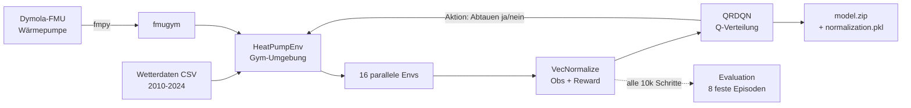

# Bedingungen für Lauf

Kurzübersicht: Wie die RL-Trainingspipeline aufgebaut ist, was die einzelnen Teile machen und warum.
Detailtiefe: [[Arbeitsstand]] · [[Pipeline für Setup]] · [[FMU Integration in Gym Env]]

---

## 1. Die Kette in einem Bild

---

## 2. Was die einzelnen Teile machen

| Baustein | Aufgabe |
|---|---|
| **Dymola-FMU** | Physik der Anlage. Rechnet Reif, COP, Temperaturen. Der "Prüfstand". |
| **fmpy** | Lädt und taktet die FMU aus Python heraus (`do_step`). |
| **fmugym** | Klebeschicht: verpackt die FMU in ein Gym-Interface (reset/step/obs/reward), damit RL-Frameworks sie überhaupt ansprechen können. |
| **HeatPumpEnv** | Definiert das eigentliche Lernproblem: Observation, Aktionsraum (0 = Heizen, 1 = Abtauinitiierung), Reward = relativer Gütegrad $COP/COP_{Carnot}$, Episodenende. |
| **Wetterdaten** | Randbedingungen pro Schritt, aus CSV interpoliert auf 100 s. |
| **VecEnv (16x)** | 16 Umgebungen laufen gleichzeitig → Sampling-Durchsatz, sonst dauert ein Lauf ewig. |
| **VecNormalize** | Skaliert alle Eingänge auf vergleichbare Größenordnung. |
| **QRDQN** | Das Netz. Lernt zu jeder Aktion eine Q-Wert-**Verteilung** statt nur einen Mittelwert. |
| **EvalCallback** | Zieht alle 10 000 Schritte den festen Evaluationssatz durch → Lernkurve für die Auswertung. |

---

## 3. Inputs in die FMU

- Außenlufttemperatur
- Luftfeuchte
- Sollwert Vorlauftemperatur
- Abtauen (= die Agentenaktion)
- Heizlast

---

## 4. Zeitrechnung des Laufs

| Größe | Wert | Entspricht |
|---|---|---|
| Schrittweite | 100 s | – |
| Episodenlänge | 864 Schritte | 1 Tag |
| Parallele Envs | 16 | – |
| Gesamt-Timesteps | 150 000 | ≈ 174 Episoden → **ca. 170 Tage = eine Heizperiode** |
| Evaluationsintervall | alle 10 000 Schritte | 15 Messpunkte über den Lauf |

> [!note] Merksatz
> Der Agent sieht über einen kompletten Lauf ungefähr so viel Anlagenbetrieb wie ein halbes Jahr reale Heizperiode – nur eben auf 16 Umgebungen parallel zusammengeschoben.

---

## 5. Datensätze

- **Training:** Wetterdaten 2010–2024
- **Validierung:** 2025 (vom Training komplett getrennt)
- **Evaluation während des Trainings:** 8 Episoden, zu Beginn per festem Seed gezogen und dann **unverändert** für jeden Evaluationspunkt wiederverwendet

*Warum fest:* Nur wenn der Evaluationssatz identisch bleibt, sind die Ergebnisse bei Schritt 10 000 und 150 000 überhaupt vergleichbar. Sonst misst man Wetterglück statt Lernfortschritt. → wichtig für die Auswertung.

---

## 6. Warum Normalisierung

Die Rohwerte im Observationsvektor haben völlig unterschiedliche Größenordnungen (Temperaturgradienten vs. letzte Aktion als 0/1). Ohne Skalierung dominieren die großen Zahlen den Gradienten, und kleine, aber relevante Signale gehen unter → schlechteres Training.

Darum am Ende **zwei Artefakte**, die immer zusammengehören:

- `model.zip` → Netzgewichte
- `normalization.pkl` → die Statistiken ($\mu$, $\sigma$) der Normalisierung

> [!warning] Ohne die `.pkl` ist das Modell wertlos
> Lädt man das Netz mit anderen Normalisierungsstatistiken, bekommt es anders skalierte Eingänge als im Training → Performance bricht sofort ein. Siehe [[FMU Integration in Gym Env]], Bug 1.

---

## 7. Warum QRDQN

Das Netz predictet nicht einen einzelnen Q-Wert, sondern eine **Q-Wert-Verteilung** (Quantile). Das macht das Lernen stabiler gegenüber Ausreißern – relevant hier, weil das thermodynamische System stark verrauscht und träge ist (Eiswachstum wirkt erst lange nach der Aktion).

---
#reinforcement-learning #fmu #training #diplom
