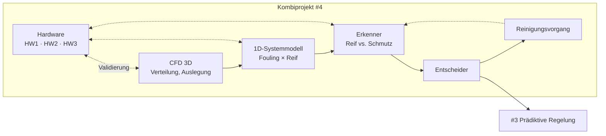

# Projektideen Wärmepumpe – Übersicht

> [!abstract] Kern
> Drei ursprünglich getrennte Ideen laufen auf ein gemeinsames Vorhaben hinaus: Ein Außenwärmeübertrager, der seinen eigenen Zustand kennt (Reif vs. Verschmutzung), daraus eine Betriebsentscheidung ableitet und sich bei Bedarf selbst reinigt.

## Aktueller Stand

> [!success] Ideen 1 und 2 sind zusammengeführt
> → **[[04 Kombiprojekt Simulation und Verschmutzungserkennung]]** ist die aktive Projektnotiz.
> Die Einzelnotizen bleiben als Materialsammlung bestehen.

| # | Idee | Notiz | Status |
|---|------|-------|--------|
| **4** | **Kombiprojekt: Simulation → Hardware → Erkenner → Entscheider → Reinigung** | [[04 Kombiprojekt Simulation und Verschmutzungserkennung]] | **aktiv** |
| 1 | CFD-Simulation Verschmutzung | [[01 Fouling CFD Verdampfer]] | aufgegangen in #4 |
| 2 | Verschmutzungserkennung | [[02 Verschmutzungserkennung WP]] | aufgegangen in #4 |
| 3 | Prädiktiver Lastmanager / MPC | [[03 Frostbewusste MPC WP]] | Anschlussthema |

## Zusammenhang

Die drei Modellebenen sind durch unvereinbare Zeitskalen erzwungen, nicht gewählt: CFD rechnet Sekunden, das 1D-Modell Jahresverläufe, der Regler Millisekunden.

## Leitsatz für alle drei

> [!warning] Der wiederkehrende Fallstrick
> Alle drei Themen scheitern an derselben Stelle: **Validierung**. Ohne echte Messdaten aus Prüfstand oder Feld ist keins von ihnen begutachtungsfähig. Simulation allein trägt kein Projekt.

## Nächste Schritte

- [ ] Machbarkeitsgrafik erzeugen (siehe [[02 Verschmutzungserkennung WP#Schnelltest vor allem anderen]])
- [ ] Patentrecherche Abtausteuerung / Blockadeerkennung → Freedom to Operate
- [ ] Gespräch mit ILK Dresden bzw. Kältetechnik TU Dresden suchen
- [ ] Literaturordner anlegen → [[99 Literatur WP Fouling]]
- [ ] Entscheiden: Abschlussarbeit, Promotionsthema oder Förderantrag?

## Förderwege (grob)

| Weg | Passt zu | Anmerkung |
|-----|----------|-----------|
| IGF / AiF | #2 mit Industriekonsortium | bester Fit, braucht Forschungsvereinigung + Industriepartner |
| BMWK Energieforschung | #2 + #3 kombiniert | Wärmepumpen-Module, größer dimensioniert |
| DFG | nur #1 in grundlagenorientierter Zuspitzung | Anwendungsnähe eher hinderlich |
| Abschlussarbeit | Einzelnes AP aus #2 | realistischer Einstieg |
