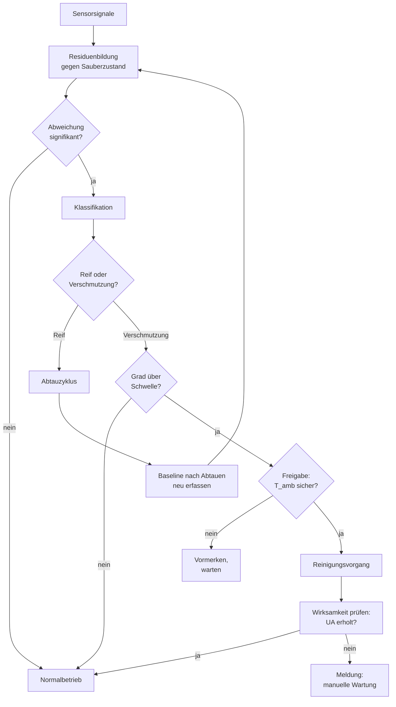

# Verschmutzungserkennung und Selbstreinigung für WP-Außenwärmeübertrager

> [!abstract] Arbeitstitel
> Modellgestützte Unterscheidung von Reifbildung und Partikelverschmutzung am Außenwärmeübertrager von Luft-Wasser-Wärmepumpen mit abgeleiteter Abtau- und Reinigungsentscheidung.

---

## 1 Problemstellung

Die heutige Bedarfsabtauung misst die Temperaturdifferenz zwischen Außenluft und Lamellenoberfläche und schließt daraus auf Reif. **Eine verschmutzte Lamelle erzeugt exakt dieselbe Signatur**: reduzierter Luftvolumenstrom, abgesenkte Verdampfungstemperatur, größeres ΔT.

Folgen:

- Unnötige Abtauzyklen → Wärmeverlust, Kompressorstarts, Komfortverlust
- Verschmutzung bleibt unerkannt, bis der Nutzer die Anlage anfasst (meist gar nicht)
- Verschmutzung beschleunigt zusätzlich das Reifwachstum → Rückkopplung, die sich selbst verstärkt
- Wartung erfolgt kalenderbasiert statt zustandsbasiert

> [!info] Wirtschaftlicher Hebel
> Jeder vermiedene Fehl-Abtauzyklus ist direkt in kWh und JAZ ausdrückbar. Das ist die Zahl, die im Antrag auf Seite eins gehört.

---

## 2 Kernidee

> [!tip] Der Trick
> **Reif ist reversibel, Verschmutzung nicht.**
> Der Abtauzyklus, den die Anlage ohnehin fährt, ist ein aktiver Testimpuls. Der Systemzustand *nach* dem Abtauen ist die Verschmutzungsbasislinie.

Vergleich vor/nach Abtauen:

- Kennwert erholt sich vollständig → es war Reif
- Kennwert bleibt abgesenkt → Verschmutzungsniveau
- Drift dieser Post-Defrost-Baseline über Wochen **ist** das Foulingsignal

Vorteil: keine Zusatzsensorik zwingend nötig, Messung erfolgt im ohnehin stattfindenden Betriebsereignis.

### Diskriminatoren

| Merkmal | Reif | Verschmutzung |
|---|---|---|
| Zeitskala | Stunden | Wochen–Monate |
| Reversibel durch Abtauen | ja | nein |
| Wetterfenster | ca. −5…+7 °C, hohe r.F. | wetterunabhängig |
| Latentanteil | entzieht Luft Feuchte | keiner |
| Verlaufsform | zyklisch, sägezahnartig | monoton, langsam |
| Räumliche Verteilung | relativ gleichmäßig | Anströmkante, bei Blättern lokal/einseitig |
| Blätter speziell | – | sprunghafter Stufeneffekt |

---

## 3 Hypothesen

- **H1** – Die Post-Defrost-Baseline des UA-Werts driftet monoton mit dem Verschmutzungsgrad und springt nach einer Reinigung zurück.
- **H2** – Die Feuchtebilanz über den Wärmeübertrager trennt Reif von trockener Ablagerung robuster als jede Temperaturgröße allein.
- **H3** – Physikinformierte Residuen-Features benötigen ein bis zwei Größenordnungen weniger Trainingsdaten als End-to-End-Lernen und übertragen sich auf andere Anlagengrößen.
- **H4** – Der Verschmutzungsgrad verschiebt die Reifgrenze messbar; Reif- und Foulingschätzung müssen deshalb gekoppelt erfolgen.
- **H5** – Ein zustandsbasierter Reinigungsvorgang stellt den UA-Wert auf > 90 % des Sauberzustands wieder her.

> [!danger] Störfaktor, der H1 kippen kann
> Unvollständiges Abtauen: Restwasser bleibt durch Oberflächenspannung auf der Lamelle und gefriert im nächsten Heizzyklus wieder. Das sieht aus wie Verschmutzung. Muss explizit modelliert und im Algorithmus behandelt werden.

---

## 4 Abgrenzung zum Stand der Technik

| Bekannt | Offen |
|---|---|
| Bedarfsabtauung über ΔT Luft/Lamelle | Unterscheidung Reif ↔ Verschmutzung |
| Blockade-Erkennung (Patentliteratur) | Quantifizierung des Verschmutzungsgrads |
| Fouling als "soft fault" in FDD-Literatur | physikalisch fundiertes Foulingmodell statt Lüfterdrosselung als Ersatz |
| Luftseitiges Fouling mit Prüfstaub | reale Außenluft, Pollen, Blätter, Kombinationen |
| Reif-/Abtaumodelle | Kopplung Fouling × Reif |
| – | geschlossener Kreis bis zur Reinigungsaktion |

> [!warning] Patentlage prüfen
> Druckverlustmessung, ΔT-Verfahren, photooptische Reifdetektion, Kapazitätsmessung und Lüfterlast-Auswertung sind sämtlich patentiert oder waren es. **Freedom-to-Operate-Analyse vor Antragstellung**, nicht danach.

---

## 5 Arbeitspakete

### AP0 – Recherche und Abgrenzung
- [ ] Systematische Literaturrecherche luftseitiges Fouling + Reif + FDD
- [ ] Patentrecherche Abtausteuerung / Blockadeerkennung, FTO-Bewertung
- [ ] Nutzenabschätzung: kWh und JAZ pro vermiedenem Fehl-Abtauzyklus
- [ ] Entscheidung Zielanlage (Größe, Hersteller, Datenschnittstelle)

### AP1 – Physikmodell und synthetische Daten
Kein CFD. Ein 1D- oder Zellenmodell, das Jahresverläufe in Minuten rechnet.

- [ ] Lamellenverdampfer als Zellenmodell (Python oder Modelica/Dymola)
- [ ] Einfacher Kältekreis, Kältemittelseite als Randbedingung
- [ ] Reifmodell inkl. Restwasser-Wiedergefrieren
- [ ] Foulingschicht als variabler Wärmeleitwiderstand + Querschnittsverengung
- [ ] Kopplungsterm Fouling → Reifwachstum
- [ ] Generierung gelabelter Jahresverläufe über den Parameterraum

> [!note] Zweck
> Die synthetischen Daten dienen dem **Vortraining und der Methodenentwicklung**, nie als alleinige Validierungsgrundlage.

### AP2 – CFD-Teilmodell (ANSYS Fluent)
Bewusst klein gehalten. Drei konkrete Fragen, sonst nichts.

- [ ] Periodische Lamellen-Einheitszelle, CHT, Validierung gegen Nu-/f-Korrelation
- [ ] DPM-Einwegrechnung: Wo lagert sich Schmutz zuerst ab? → **Sensorpositionierung**
- [ ] Wandschubspannung und Strahlreichweite → **Auslegung der Reinigungsdüse**
- [ ] Optional: Verteilung → integrales Signal als Kalibrierung für AP1
- [ ] Lizenzcheck: Rocky DEM für nicht-sphärische Partikel verfügbar?

→ Details siehe [[01 Fouling CFD Verdampfer]]

### AP3 – Prüfstand und Instrumentierung
Hier entsteht die Datenbasis. Ohne dieses AP kein Projekt.

- [ ] Klimaprüfstand oder instrumentierte Feldanlage beschaffen/aufbauen
- [ ] Sensorik installieren (siehe [[#6 Messkonzept]])
- [ ] Referenzmessung Sauberzustand über mehrere Betriebspunkte
- [ ] Beschleunigte Verschmutzung mit definiertem Prüfstaub, gravimetrisch gewogen
- [ ] Reifversuche im kritischen Fenster, mit und ohne Vorverschmutzung
- [ ] Kamera als **Ground-Truth-Generator** (nicht als Produktsensor)
- [ ] Kombinationsversuche: Staub + Feuchte, Pollen, Laubeintrag

### AP4 – Erkennungsalgorithmus
> [!important] Grey-Box statt Black-Box
> Keine Rohsignale in ein großes Netz. Erst physikalisch interpretierbare Residuen bilden, dann darauf lernen.

- [ ] Virtuelle Sensoren: UA-Wert, Luftvolumenstrom über Ventilatorkennlinie
- [ ] Residuenbildung gegen Sauberzustandsmodell
- [ ] Post-Defrost-Baseline-Tracking implementieren (Kern von H1)
- [ ] Anomalieerkennung auf Sauberzustand trainieren (umgeht Labelproblem)
- [ ] Klassifikator auf Residuen-Features: Gradient Boosting bzw. kleines GRU/1D-CNN über Abtauzyklus-Fenster
- [ ] Verschmutzungsgrad als kontinuierliche Schätzgröße, nicht nur binär
- [ ] **Out-of-Distribution-Evaluation**: Training Anlage A–C, Test Anlage D; Training Saison 1, Test Saison 2

> [!danger] Die wahrscheinlichste Falle
> Ein Netz auf Rohdaten lernt die **Jahreszeit** statt die Physik. Eis korreliert mit Winter, Pollen mit Mai. 96 % Testgenauigkeit, dann Versagen beim nassen Laubbefall im Oktober. Random Split ist wertlos, saison- und anlagenweiser Split ist Pflicht.

### AP5 – Entscheider
- [ ] Kostenfunktion: Abtauverluste vs. Reinigungskosten vs. Wirkungsgradverlust
- [ ] Regelbasierte Referenzlogik (Baseline, muss geschlagen werden)
- [ ] Modellprädiktiver Entscheider auf Basis des AP1-Modells
- [ ] Umgang mit Schätzunsicherheit (formal POMDP – aber pragmatisch lösen)
- [ ] Optional RL als Vergleich – nur wenn es MPC in einem konkreten Punkt schlägt
- [ ] Freigabelogik und Sicherheitsschranken

### AP6 – Reinigungsaktorik
> [!warning] Hier stolpert das Projekt am ehesten
> Nicht die Erkennung ist das Risiko, sondern die Aktorik. Wasser auf eine Außeneinheit zu sprühen ist genau in der Frostsaison gefährlich.

| Mechanismus | Wirksam gegen | Frostrisiko | Bewertung |
|---|---|---|---|
| Wasserspülung | Staub, Pollen, verbackene Schichten | **hoch** | nur oberhalb Sicherheitstemperatur freigeben |
| Druckluftimpuls | loser Staub | keins | begrenzte Wirkung bei Feuchtstaub |
| Lüfterumkehr | Blätter, grobe Verblockung | keins | einfach umsetzbar, geringe Tiefenwirkung |
| Vibration / Ultraschall | lose Ablagerungen | keins | Wirksamkeit unklar, Geräuschthema |
| Kondensatnutzung | Staub | mittel | elegant, aber Menge begrenzt |

- [ ] Mechanismusauswahl anhand AP2-Ergebnissen (Schubspannung, Strahlreichweite)
- [ ] Prototyp aufbauen
- [ ] Temperaturfreigabe und Vereisungsschutz implementieren
- [ ] Wirksamkeitsnachweis: UA-Erholung nach Reinigung messen (H5)
- [ ] Wasser-/Energieverbrauch pro Reinigungsvorgang bilanzieren
- [ ] Materialverträglichkeit: Beschichtung, Korrosion, Lebensdauer

> [!tip] Günstiger Zufall
> Pollensaison ist nicht Frostsaison. Eine temperaturfreigegebene Wasserspülung deckt den wichtigsten Verschmutzungsfall ab, ohne das Frostproblem zu berühren.

### AP7 – Feldtest und Bewertung
- [ ] Mindestens eine Heizsaison + eine Pollensaison auf realer Anlage
- [ ] Vergleich gegen Serienregelung derselben Anlage
- [ ] Bewertung nach [[#7 Bewertungsmetriken]]
- [ ] Übertragbarkeitstest auf zweite Anlagengröße

---

## 6 Messkonzept

| Größe | Sensor | Kosten | Nutzen | Priorität |
|---|---|---|---|---|
| Lüfterleistung + Drehzahl | EC-Lüfter über Bus | **0 €** | Luftvolumenstrom-Proxy über Kennlinie | **hoch** |
| Lamellenoberflächentemperatur | 2–3 verteilte Fühler | gering | räumliche Ungleichverteilung → Blätter | hoch |
| Lufteintritts-/-austrittstemperatur | Standard | gering | UA-Schätzung | hoch |
| Luftfeuchte Ein-/Austritt | kapazitiv | mittel | **trennt Reif von trockener Schicht** | hoch |
| Verdampfungstemperatur / Druck | meist vorhanden | 0 € | Systemzustand | hoch |
| Luftseitiger Differenzdruck | Δp-Sensor | mittel | direktestes Foulingsignal, aber im Serienprodukt unüblich | mittel |
| Kamera | Kleinkamera | gering | **nur Ground Truth im Versuch** – als Produktsensor fragwürdig | Versuch |

> [!note] Designleitlinie
> Alles, was im Feldprodukt landen soll, muss ohne Zusatzsensorik auskommen. Zusatzsensorik nur im Prüfstand zur Erzeugung der Wahrheit.

---

## 7 Bewertungsmetriken

**Erkennung**
- Detektionsrate / Falsch-Positiv-Rate je Zustand
- Mittlere Detektionszeit ab Überschreiten des Schwellwerts
- Verwechslungsmatrix Reif ↔ Verschmutzung ↔ Blätter ↔ Normalbetrieb
- Schätzfehler des Verschmutzungsgrads (RMSE gegen gravimetrische Referenz)
- Übertragbarkeit: Leistungsabfall bei Test auf ungesehener Anlage

**Entscheider**
- Anzahl vermiedener Fehl-Abtauzyklen
- JAZ-Gewinn gegenüber Serienregelung
- Anzahl ausgelöster Reinigungsvorgänge vs. tatsächlicher Bedarf

**Reinigung**
- UA-Wiederherstellungsgrad
- Verbrauch (Wasser, Energie) pro Vorgang
- Standzeit bis zum nächsten Bedarf

---

## 8 Risiken

| Risiko | Auswirkung | Gegenmaßnahme |
|---|---|---|
| Zu wenig gelabelte Daten | Algorithmus nicht trainierbar | Anomalieerkennung auf Sauberzustand, synthetisches Vortraining |
| Restwasser-Wiedergefrieren stört Baseline | H1 kippt | explizit modellieren, Erholungszeit nach Abtauen abwarten |
| Klassifikator lernt Jahreszeit | Versagen im Feld | saison- und anlagenweiser Split, physikinformierte Features |
| Patentkollision | Verwertung blockiert | FTO in AP0, nicht später |
| Reinigung erzeugt Vereisungsschaden | Sicherheitsproblem | harte Temperaturfreigabe, Wirksamkeitsprüfung nach Vorgang |
| Adhäsionsparameter für Pollen unbekannt | CFD nicht validierbar | CFD nur für Auslegungsfragen nutzen, nicht für Absolutwerte |
| Konkurrenz durch etablierte Gruppen | Neuheit angreifbar | Nische Reif×Fouling besetzen, nicht frontal gegen FDD-Mainstream |

---

## 9 Schnelltest vor allem anderen

> [!tip] Machbarkeitsnachweis in einem Diagramm
> 1. Offenen WP-Datensatz nehmen oder eine reale Anlage eine Saison mitloggen
> 2. Post-Defrost-Baseline des UA-Werts berechnen
> 3. Über die Zeit plotten
>
> **Zeigt sich eine monotone Drift, die nach manueller Reinigung zurückspringt, ist das ganze Projekt belegt.**
> Diese Grafik gehört auf Seite eins jedes Antrags.

- [ ] Datenquelle identifizieren
- [ ] UA-Schätzung implementieren
- [ ] Baseline-Extraktion aus Abtauereignissen
- [ ] Plot erzeugen und bewerten

---

## 10 Offene Fragen

- Welche Anlagengröße als Referenz? Ein- oder Mehrfamilienhaus?
- Datenschnittstelle: Hersteller-Bus, Modbus, oder eigene Nachrüstung?
- Wird der Verschmutzungsgrad kontinuierlich geschätzt oder nur klassifiziert?
- Ist der Δp-Sensor im Serienprodukt vertretbar, oder muss es ohne gehen?
- Reinigungsmechanismus: einer oder Kombination?
- Wer liefert den Prüfstand – eigene Infrastruktur oder Partner?
- Zeitrahmen: Abschlussarbeit (ein AP) oder Vollprojekt (alle APs)?

---

## 11 Notizen

<!-- Platz für laufende Gedanken -->

