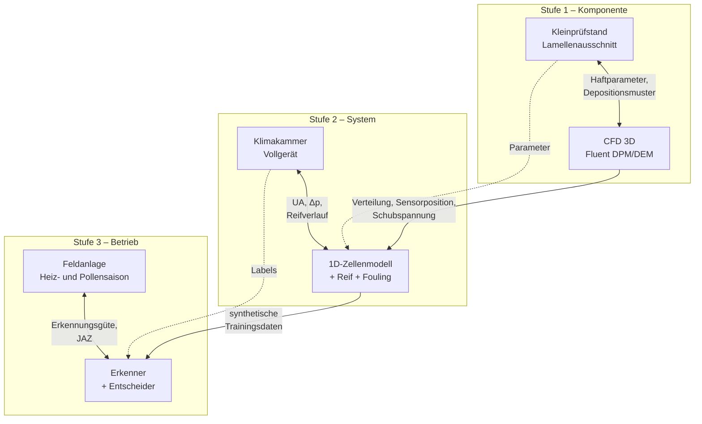

# Simulationsgestützte Verschmutzungserkennung und Selbstreinigung

> [!abstract] Kernthese
> Ein Außenwärmeübertrager, der seinen eigenen Zustand kennt. Die Simulation liefert das physikalische Vorwärtsmodell und die Auslegung, die Hardware liefert Wahrheit und Nachweis. Am Ende stehen drei Artefakte: **Erkenner**, **Entscheider**, **Reinigungsvorgang**.

---

## 1 Warum die Kombination trägt

Getrennt ist keins der beiden Teilthemen tragfähig:

| | allein | in Kombination |
|---|---|---|
| **CFD** | seit 1980 besetzt, Absolutwerte nicht validierbar | beantwortet Auslegungsfragen, die das Experiment nicht abdecken kann (Sensorposition, Düsenreichweite, Schubspannungsverteilung) |
| **Erkennung** | Datenproblem, keine Labels, keine Physik | bekommt synthetische Trainingsdaten, physikalisch interpretierbare Features und ein erklärbares Fehlermodell |

Die Verbindung ist nicht kosmetisch: Das CFD-Modell liefert die **räumliche Verteilung**, die das 1D-Modell nicht kennt, und das 1D-Modell liefert die **Jahresverläufe**, die CFD nie rechnen kann. Beide zusammen erzeugen den Datensatz, aus dem der Erkenner lernt.

---

## 2 Methodisches Leitbild

> [!danger] Der Fallstrick: Wasserfall
> "Erst alles simulieren, dann validieren" ist die naheliegende, aber gefährliche Struktur. Die Adhäsionsparameter für Pollen oder Feuchtstaub auf beschichtetem Aluminium **existieren in der Literatur nicht**. Ohne frühe Messung baust du ein Modell auf geratenen Zahlen. Scheitert die Validierung am Ende, ist das Projekt tot.

**Stattdessen: verschränkte Schleife mit drei Validierungsstufen.**

> [!tip] Reihenfolge in der Zeit
> Stufe 1 läuft **parallel** zum Modellaufbau, nicht danach. Der Kleinprüfstand ist billig und liefert genau die Parameter, ohne die das CFD-Modell rät. Erst wenn Stufe 1 geschlossen ist, wird in Stufe 2 investiert.

### Gate-Kriterien

| Gate | Bedingung zum Weitergehen | Wenn nicht erfüllt |
|---|---|---|
| **G1** nach Stufe 1 | CFD trifft Depositionsmuster und Abscheidegrad qualitativ; Haftparameter bestimmt | CFD auf reine Strömungsauslegung reduzieren, Fouling rein empirisch |
| **G2** nach Stufe 2 | 1D-Modell bildet UA- und Δp-Verlauf über Verschmutzungsgrad ab; H1 im Prüfstand bestätigt | Erkennung ohne Modell aufbauen (rein datengetrieben, engerer Anspruch) |
| **G3** nach Stufe 3 | Erkennungsgüte im Feld hält Prüfstandsniveau | Ergebnis als Prüfstandsverfahren verwerten, nicht als Produktfunktion |

---

## 3 Modellkaskade

Drei Modelle, klar getrennte Aufgaben und definierte Übergabegrößen. Das ist der Teil, den Gutachter prüfen.

| Ebene | Werkzeug | Rechenzeit | Aufgabe | Übergibt an nächste Ebene |
|---|---|---|---|---|
| **3D** | ANSYS Fluent, DPM / Rocky DEM, CHT | Stunden–Tage pro Betriebspunkt | Depositionsverteilung, lokale Wärmeübergangsdegradation, Wandschubspannung, Strahlreichweite | Verteilungsfunktion über Lamellentiefe, Korrekturfaktoren, Δp-Kennlinie |
| **1D** | Zellenmodell (Python / Modelica) + Kältekreis + Reifmodell | Minuten pro Jahresverlauf | Betriebsverhalten über Wochen und Saisons, Fouling × Reif-Kopplung | gelabelte Zeitreihen, Sauberzustandsreferenz |
| **0D** | Kennfeld / Surrogat | Millisekunden | Echtzeitfähige Residuenbildung auf dem Regler | Residuen als Features |

> [!note] Warum drei Ebenen
> Die Zeitskalen sind unvereinbar: Fouling wächst über Monate, ein CFD-Zeitschritt liegt im Millisekundenbereich. Ohne diese Kaskade ist das Problem schlicht nicht rechenbar. Das ist auch das Argument, wenn jemand fragt, warum nicht "einfach alles in CFD".

---

## 4 Hardware-Stränge

### HW1 – Kleinprüfstand Lamellenausschnitt
**Zweck:** Parameterbestimmung für CFD. Billig, schnell, früh.

- Kleiner Windkanal, wenige Lamellen, definierte Anströmung
- Partikeldosierung: ISO-Prüfstaub, später Pollen und Realstaub
- Gravimetrische Erfassung der abgelagerten Masse
- Optische Erfassung der Verteilung (Kamera, ggf. Mikroskopie)
- Δp-Messung über dem Ausschnitt

- [ ] Aufbau spezifizieren
- [ ] Partikelquellen beschaffen (Prüfstaub, Pollen aus Imkereibedarf oder Allergendiagnostik)
- [ ] Haftwahrscheinlichkeit über Anströmgeschwindigkeit bestimmen
- [ ] Feuchteabhängigkeit der Haftung charakterisieren
- [ ] Ablösung: bei welcher Schubspannung / welchem Strahldruck löst sich die Schicht?

> [!important] Der letzte Punkt ist doppelt wertvoll
> Er liefert gleichzeitig den Haftparameter für die Simulation **und** die Auslegungsgrundlage für den Reinigungsvorgang. Ein Versuch, zwei Ergebnisse.

### HW2 – Klimakammer, komplettes Außengerät
**Zweck:** Systemvalidierung und Labelerzeugung.

- Konditionierbare Luft: Temperatur, Feuchte im Reiffenster einstellbar
- Kältekreis instrumentiert
- Beschleunigte Verschmutzung mit gewogener Staubmenge
- Referenzmessung Sauberzustand über mehrere Betriebspunkte

- [ ] Versuchsmatrix: Verschmutzungsgrad × Betriebspunkt × Reifbedingung
- [ ] Reifversuche mit und ohne Vorverschmutzung → **Kopplungsnachweis**
- [ ] Abtau-/Wiedergefrier-Verhalten dokumentieren (Störfaktor für H1)
- [ ] Kamera als Ground-Truth-Generator installieren
- [ ] Laubeintrag als separater Versuchsfall
- [ ] Reinigungsprototyp einbauen und Wirksamkeit messen

### HW3 – Feldanlage
**Zweck:** Nachweis unter realen Bedingungen, Übertragbarkeit.

- Mindestens eine Heizsaison **und** eine Pollensaison
- Parallel Serienregelung als Vergleich
- Zweite Anlage anderer Größe für Übertragbarkeitstest

- [ ] Anlage und Standort akquirieren
- [ ] Datenlogging aufsetzen (Bus-Schnittstelle klären)
- [ ] Periodische manuelle Referenzreinigung als Ground Truth
- [ ] Wetterdaten der nächstgelegenen Station anbinden (Pollenflug, Sahara-Staub-Ereignisse)

---

## 5 Validierungsmatrix

Das zentrale Dokument des Projekts. Ohne diese Tabelle ist der Antrag angreifbar.

| ID | Modell | Validiert gegen | Größe | Akzeptanzkriterium | Stufe |
|---|---|---|---|---|---|
| V1 | CFD sauber | Nu-/f-Korrelation aus Literatur | Wärmeübergang, Druckverlust | ±10 % | 1 |
| V2 | CFD DPM | HW1 gravimetrisch | Abscheidegrad | ±30 %, Trend korrekt | 1 |
| V3 | CFD DPM | HW1 optisch | Depositionsverteilung über Lamellentiefe | qualitativ, Schwerpunkt an Anströmkante | 1 |
| V4 | Haftmodell | HW1 Feuchtevariation | Haftwahrscheinlichkeit | Monotonie korrekt | 1 |
| V5 | 1D sauber | HW2 Sauberzustand | UA, Δp | ±5 % | 2 |
| V6 | 1D Fouling | HW2 Verschmutzungsstufen | UA(m_Schmutz), Δp(m_Schmutz) | ±15 % | 2 |
| V7 | Reifmodell | HW2 Reifversuche | Reifmasse, Abtauintervall | ±20 % | 2 |
| V8 | Kopplung | HW2 Reif × Fouling | Verschiebung der Reifrate | Vorzeichen und Größenordnung | 2 |
| V9 | Erkenner | HW2 Labels | Verwechslungsmatrix | TPR > 0,9 / FPR < 0,05 | 2 |
| V10 | Erkenner | HW3 Feld | dieselben Metriken | Verschlechterung < 15 Prozentpunkte | 3 |
| V11 | Entscheider | HW3 vs. Serienregelung | vermiedene Fehl-Abtauzyklen, JAZ | signifikant besser | 3 |
| V12 | Reinigung | HW2 + HW3 | UA-Wiederherstellungsgrad | > 90 % des Sauberzustands | 2/3 |

> [!warning] Zu V2
> ±30 % klingt schwach, ist für Partikeldeposition aber realistisch ambitioniert. Lieber ein ehrliches Kriterium, das man hält, als ±5 %, das man reißt. Im Antrag begründen.

---

## 6 Arbeitspakete

### AP0 – Grundlagen und Abgrenzung
- [ ] Literaturrecherche Fouling luftseitig / Reif / FDD
- [ ] **Patentrecherche + Freedom-to-Operate** (Abtausteuerung, Blockadeerkennung, Reinigungsverfahren)
- [ ] Nutzenabschätzung in kWh und JAZ
- [ ] Zielanlage und Datenschnittstelle festlegen
- [ ] Lizenzcheck ANSYS: Rocky DEM verfügbar?

### AP1 – Kleinprüfstand und Parametercharakterisierung *(HW1)*
→ läuft parallel zu AP2, nicht danach

### AP2 – CFD-Modell *(Stufe 1)*
- [ ] Periodische Lamellen-Einheitszelle, CHT
- [ ] Validierung sauber (V1)
- [ ] DPM-Einwegrechnung: Depositionsverteilung (V2, V3)
- [ ] Haftmodell mit HW1-Parametern (V4)
- [ ] **Sensorpositionierung ableiten**
- [ ] Wandschubspannung und Strahlreichweite → **Düsenauslegung**
- [ ] Übergabegrößen an 1D-Modell extrahieren

> [!note] Bewusste Begrenzung
> Kein Schichtwachstum mit Remeshing, keine Blätter als 6-DOF-Körper, kein gekoppelter Phasenwechsel. Das wäre Stufe 3 im alten Stufenmodell und sprengt jedes Projekt. Der CFD-Anteil beantwortet vier konkrete Fragen und hört dann auf.

### AP3 – 1D-Systemmodell *(Stufe 2)*
- [ ] Zellenmodell Lamellenverdampfer + Kältekreis
- [ ] Reifmodell inkl. Restwasser-Wiedergefrieren
- [ ] Foulingschicht aus CFD-Verteilung parametriert
- [ ] Kopplungsterm Fouling → Reifwachstum
- [ ] Validierung V5–V8 gegen HW2
- [ ] Generierung gelabelter Jahresverläufe

### AP4 – Klimakammerversuche *(HW2)*
### AP5 – Erkenner
- [ ] Virtuelle Sensoren: UA, Luftvolumenstrom über Ventilatorkennlinie
- [ ] Residuenbildung gegen Sauberzustandsmodell
- [ ] **Post-Defrost-Baseline-Tracking** (Kernhypothese)
- [ ] Anomalieerkennung auf Sauberzustand
- [ ] Klassifikator auf Residuen-Features
- [ ] Verschmutzungsgrad kontinuierlich schätzen
- [ ] Out-of-Distribution-Evaluation (Anlage, Saison)

### AP6 – Entscheider
- [ ] Kostenfunktion Abtauen vs. Reinigen vs. Nichtstun
- [ ] Regelbasierte Referenzlogik
- [ ] Modellprädiktiver Entscheider auf AP3-Modell
- [ ] Sicherheitsschranken und Freigabelogik

### AP7 – Reinigungsvorgang
- [ ] Mechanismusauswahl auf Basis AP2 (Schubspannung) und AP1 (Ablösedruck)
- [ ] Prototyp aufbauen
- [ ] Temperaturfreigabe / Vereisungsschutz
- [ ] Wirksamkeitsnachweis (V12)
- [ ] Verbrauchsbilanz Wasser und Energie
- [ ] Materialverträglichkeit, Korrosion, Lebensdauer

### AP8 – Feldtest und Verwertung *(HW3, Stufe 3)*
- [ ] Feldbetrieb über zwei Saisons
- [ ] Validierung V10, V11
- [ ] Übertragbarkeitstest zweite Anlage
- [ ] Publikationen, ggf. Schutzrecht

---

## 7 Zeitgerüst (grob, 3 Jahre)

| Jahr | Schwerpunkt | Gate |
|---|---|---|
| 1 | AP0, AP1, AP2 – Kleinprüfstand und CFD parallel | **G1** Ende J1 |
| 2 | AP3, AP4, AP5 – Klimakammer und Modellvalidierung, Erkenner | **G2** Mitte J2 |
| 2–3 | AP6, AP7 – Entscheider und Reinigungsprototyp | |
| 3 | AP8 – Feldtest | **G3** Ende J3 |

> [!warning] Kritischer Pfad
> Der Feldtest braucht **eine Heiz- und eine Pollensaison**. Startet er nicht spätestens im Herbst des zweiten Jahres, fehlt am Projektende die Winterdatenreihe. Rückwärts planen.

---

## 8 Risiken

| Risiko | Auswirkung | Gegenmaßnahme |
|---|---|---|
| Adhäsionsparameter nicht bestimmbar | CFD nicht kalibrierbar | HW1 früh, Fallback: CFD rein auf Strömungsauslegung reduzieren (G1) |
| CFD-Verteilung stimmt nicht mit Realität | Sensorposition falsch | mehrere Fühler verteilen, Position experimentell nachjustieren |
| Restwasser-Wiedergefrieren stört Baseline | H1 kippt | explizit modellieren, Erholungszeit nach Abtauen abwarten |
| Zu wenig gelabelte Daten | Erkenner nicht trainierbar | Anomalieerkennung + synthetisches Vortraining aus AP3 |
| Klassifikator lernt Jahreszeit | Versagen im Feld | physikinformierte Features, saison-/anlagenweiser Split |
| Klimakammer nicht verfügbar | Stufe 2 blockiert | Partner früh binden, Alternativen prüfen |
| Feldtest verzögert sich | keine Wintersaison | Standort im ersten Jahr sichern |
| Patentkollision | Verwertung blockiert | FTO in AP0 |
| Reinigung erzeugt Vereisungsschaden | Sicherheitsproblem | harte Temperaturfreigabe, Wirksamkeitsprüfung nach Vorgang |

---

## 9 Ressourcenbedarf

- [ ] **Personal:** 1 Stelle Simulation/Modellierung, 1 Stelle Messtechnik/Hardware — die Doppelbesetzung ist der Kern der Idee, eine Person kann beides nicht in dieser Tiefe
- [ ] **Software:** ANSYS Fluent (+ Rocky DEM), Modelica-Umgebung oder Python
- [ ] **HW1:** Kleinwindkanal, Partikeldosierung, Waage, Kamera
- [ ] **HW2:** Klimakammer mit Feuchtekonditionierung — teuerster Posten, ggf. beim Partner
- [ ] **HW3:** Feldanlage, Logging-Hardware
- [ ] **Partner:** Hersteller (Anlage, Schnittstelle), Prüfinstitut (Kammer)

---

## 10 Anschluss

Der geschätzte Verschmutzungszustand ist die Eingangsgröße für [[03 Frostbewusste MPC WP]]. Falls das Projekt eine Verlängerung bekommt oder eine zweite Arbeit daran hängt, ist das der natürliche Anschluss: prädiktive Regelung mit selbstadaptierendem Anlagenmodell.

---

## 11 Schnelltest vor der Antragstellung

> [!tip] Machbarkeitsnachweis in einem Diagramm
> Post-Defrost-Baseline des UA-Werts über eine Saison plotten. Monotone Drift, die nach manueller Reinigung zurückspringt = ganze Projektidee belegt.

- [ ] Datenquelle finden (offener Datensatz oder eigene Anlage mitloggen)
- [ ] UA-Schätzung implementieren
- [ ] Baseline aus Abtauereignissen extrahieren
- [ ] Plot erzeugen

---

## 12 Offene Fragen

- Ein- oder Zweipersonenprojekt? (siehe Ressourcen — beeinflusst den Zuschnitt massiv)
- Klimakammer selbst oder beim Partner?
- Reinigungsmechanismus: auf einen festlegen oder zwei vergleichen?
- Wird der Verschmutzungsgrad kontinuierlich geschätzt oder nur klassifiziert?
- Verwertung: Publikation, Schutzrecht oder Industrietransfer?

---

## 13 Notizen

<!-- laufende Gedanken -->
